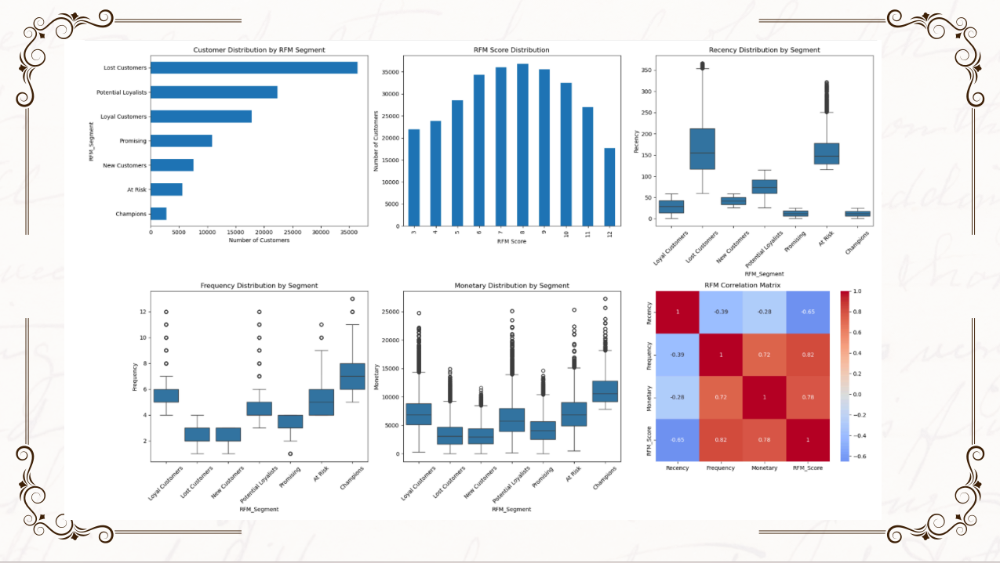
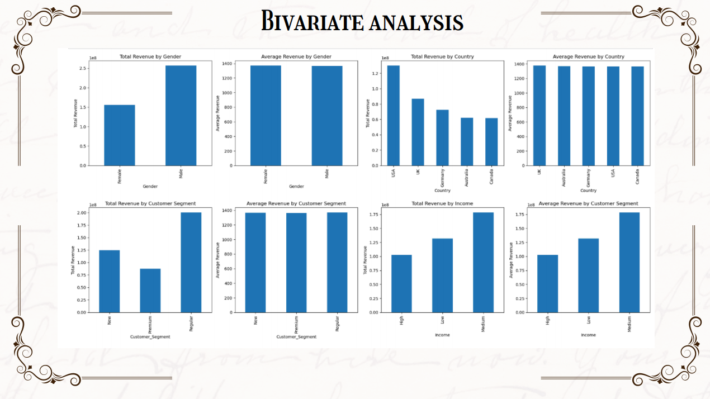
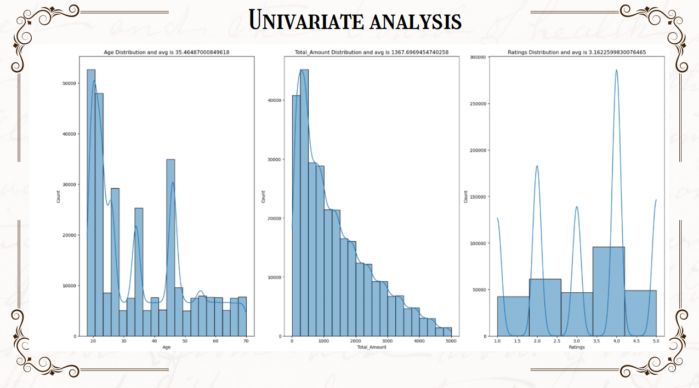
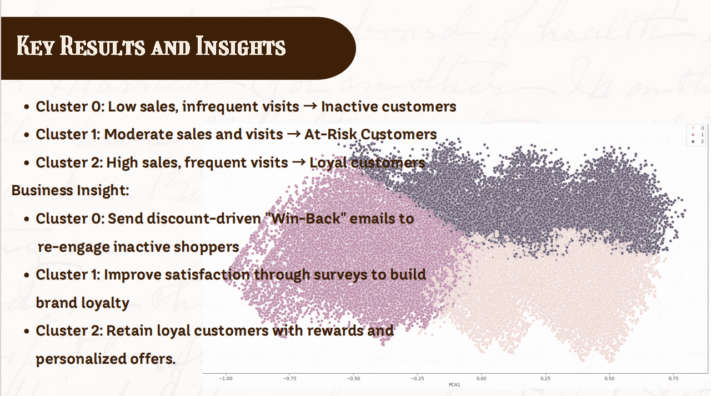

# Customer Segmentation using Machine Learning

## Overview
This project uses K-Means clustering and RFM analysis to segment customers based on purchasing behavior.

## Dataset
- Source: Kaggle  
- Records: ~300,000  
- Features: 30  

## Tools & Technologies
- Python (Pandas, NumPy)
- Scikit-learn
- Matplotlib, Seaborn
- Power BI

## Key Steps
- Data Cleaning & Preprocessing  
- Exploratory Data Analysis (EDA)  
- RFM Analysis  
- K-Means Clustering  
- PCA for dimensionality reduction  

## Results & Insights
- Segmented customers into High-Value, At-Risk, and Low-Engagement groups  
- Improved business targeting using data-driven segmentation  
- Enabled personalized marketing strategies  

## Project Output

### RFM Analysis

### Bivariate Analysis

### Univariate Analysis

### Cluster Result

